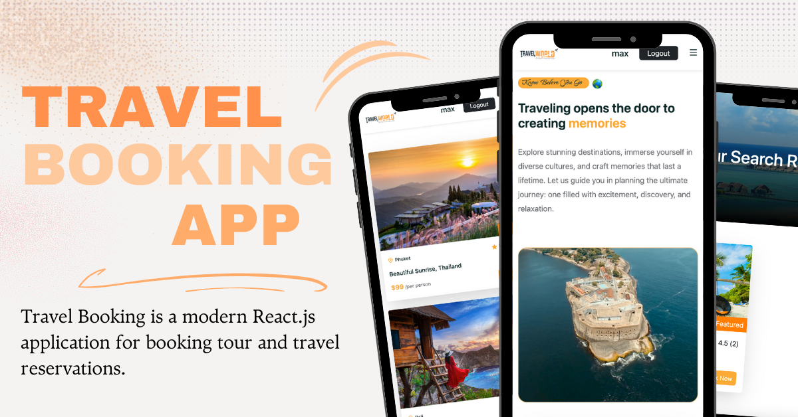

# Travel Booking

Travel Booking is a modern React.js application for booking tour and travel reservations.

## Steps to Run the Project Locally

1. **Clone the repository**
   - To clone the project, open your terminal and run the following command:
     ```bash
     git clone https://github.com/AngelaGrozdanova/Travel-Booking.git
     ```

2. **Start the Frontend**
   - Navigate to the project directory:
     ```bash
     cd tour-management
     ```
   - Enter the `frontend` folder:
     ```bash
     cd frontend
     ```
   - Start the frontend React application:
     ```bash
     npm start
     ```
   - This will start the React app and open it in your browser at [http://localhost:3000](http://localhost:3000).

3. **Start the Backend**
   - Open a new terminal window and navigate back to the main project directory:
     ```bash
     cd tour-management
     ```
   - Enter the `backend` folder:
     ```bash
     cd backend
     ```
   - Start the backend server with Nodemon:
     ```bash
     npm run start-dev
     ```
   - This will start the backend server, making it accessible at [http://localhost:4000](http://localhost:4000).

4. **Ensure Both Frontend and Backend are Running**
   - Make sure both the frontend and backend servers are running for full functionality of the app.
  
5. **Key Features:**
 - Public Access:
   - Homepage: Overview of available tours and travel packages.
   - Tour Catalog: Comprehensive list of all available tours.
   - Tour Details: Detailed information about each tour, including pricing and booking options.
   - User Authentication: Users can register and log in to access personalized features.
   - Route Guards: Unauthenticated users are restricted from accessing private routes like booking and creating tours.
 - Authenticated User Features
   - Dashboard: Logged-in users can access a private dashboard where they can view their username, email, and password.
   - Profile Management: Users can update or delete their account information, including their email address and password.
   - Review & Rating System: Logged-in users can leave reviews and provide ratings for tours.
   - Tour Booking: Ability to book travel destinations directly from the platform.
   - Create New Tour: Authenticated users have the option to create new tour entries.
   - Like/Dislike Tours: Logged-in users can like or dislike tours to provide quick feedback.
   - Redirect Logic: Logged-in users are automatically redirected away from login/register pages to prevent unnecessary access.
 - Admin Features
   - Edit Tours: Admin can edit any tour's information.
   - Delete Tours: Admin can delete any tour from the platform.
   - Test Admin Login: You can use the following credentials to log in as an admin:
       - Email: angelagrozdanova@abv.bg
       - Password: angelagrozdanova
 - Search Functionality:
   - Search Bar: Users can search for specific tours or destinations directly from the catalog.
  
6. **Technical Specifications:**
 - Frontend:
   - React.js: For a responsive and dynamic user interface.
   - React Hooks & Context API: Efficient state management and data flow.
   - Component-Based Structure: Codebase is modularized into reusable components for maintainability.
   - React Router: Client-side routing for smooth navigation between pages.
   - Lifecycle Methods: Components utilize mounting, updating, and unmounting phases using hooks like useEffect.
   - Bound Forms: Forms are fully controlled and tied to component state.
   - Synthetic Events: React's event system is used for managing form submissions and UI interactions.
   - External CSS Files: Used for styling components and pages consistently.
 - Backend:
   - Node.js & Express.js: Handle API requests and business logic.
   - MongoDB: Store and manage user data, tour details, bookings, and reviews securely.
   - Data Validation & Error Handling: Input data is validated and errors are gracefully handled to prevent crashes.
   - RESTful API: Clean and structured endpoints for frontend-backend communication.
  

